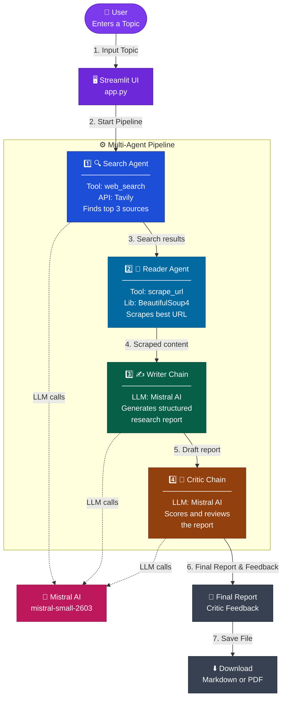

# 🔎 Multi-Agent Research Assistant

A professional multi-agent AI system that researches any topic automatically using a pipeline of specialized AI agents. Built with **LangChain**, **Mistral AI**, and **Streamlit**.

---

## 🧠 How It Works

The pipeline runs **4 agents in sequence**:

| Step | Agent | Role |
|------|-------|------|
| 1 | 🔍 Search Agent | Finds recent, reliable sources using Tavily web search |
| 2 | 📄 Reader Agent | Scrapes the most relevant URL for deeper content |
| 3 | ✍️ Writer Chain | Drafts a structured research report (Intro → Findings → Conclusion) |
| 4 | 🧐 Critic Chain | Reviews and scores the report with strengths & improvements |

---

## 🏗️ Architecture



### 🔄 Step-by-Step Flow Explanation

1. **Input Topic:** The user enters a research topic into the Streamlit UI.
2. **Start Pipeline:** The UI passes the topic to the Multi-Agent Pipeline, triggering the first agent.
3. **Search Results:** The **Search Agent** uses the Tavily API to find the most relevant and recent online sources, passing these URLs and snippets to the next step.
4. **Scraped Content:** The **Reader Agent** reviews the search results to find the best URL and uses BeautifulSoup4 to scrape the full webpage text.
5. **Draft Report:** The **Writer Chain** takes the search summaries and the full scraped content, sending them to the Mistral LLM to generate a well-structured markdown report.
6. **Final Report & Feedback:** The **Critic Chain** evaluates the draft report using the Mistral LLM, providing a score, strengths, and areas for improvement.
7. **Save File:** The final output is rendered in the UI, where the user can read it and download it as either a Markdown (`.md`) or PDF file.

---

## 🖥️ Demo

> Enter any research topic → The pipeline runs live with status updates → Download the final report as **Markdown or PDF**

---

## 🚀 Getting Started

### 1. Clone the repository

```bash
git clone https://github.com/YOUR_USERNAME/Multi-Agent-Research-Assistant.git
cd Multi-Agent-Research-Assistant
```

### 2. Create a virtual environment

```bash
python -m venv venv

# Windows
venv\Scripts\activate

# Mac / Linux
source venv/bin/activate
```

### 3. Install dependencies

```bash
pip install -r requirements.txt
pip install streamlit reportlab
```

### 4. Set up environment variables

```bash
cp .env.example .env
```

Open `.env` and fill in your API keys:

```env
MISTRAL_API_KEY="your_mistral_api_key"
TAVILY_API_KEY="your_tavily_api_key"
OPENAI_API_KEY="your_openai_api_key"   # optional, if switching to GPT
```

> Get your keys:
> - Mistral: https://console.mistral.ai/
> - Tavily: https://app.tavily.com/
> - OpenAI: https://platform.openai.com/

### 5. Run the Streamlit app

```bash
streamlit run app.py
```

Or run via command line (no UI):

```bash
python pipeline.py
```

---

## 📁 Project Structure

```
Multi_Agent_System/
├── app.py           # Streamlit UI — live agent step tracker + PDF/MD download
├── agents.py         # Agent & chain definitions (Search, Reader, Writer, Critic)
├── tools.py          # LangChain tools: web_search (Tavily) + scrape_url (BS4)
├── pipeline.py       # CLI pipeline runner (no UI)
├── requirements.txt  # Python dependencies
├── .env.example      # Template for environment variables
└── .gitignore        # Ignores .env, venv, __pycache__, etc.
```

---

## 🛠️ Tech Stack

- [LangChain](https://python.langchain.com/) — Agent orchestration & chains
- [Mistral AI](https://mistral.ai/) — LLM backbone (`mistral-small`)
- [Tavily](https://tavily.com/) — AI-powered web search API
- [BeautifulSoup4](https://www.crummy.com/software/BeautifulSoup/) — Web scraping
- [Streamlit](https://streamlit.io/) — Interactive web UI
- [ReportLab](https://www.reportlab.com/) — PDF report generation

---

## 📄 License

MIT License — feel free to use and modify.

---

## 🙌 Author

Made with ❤️ — contributions and feedback welcome!
